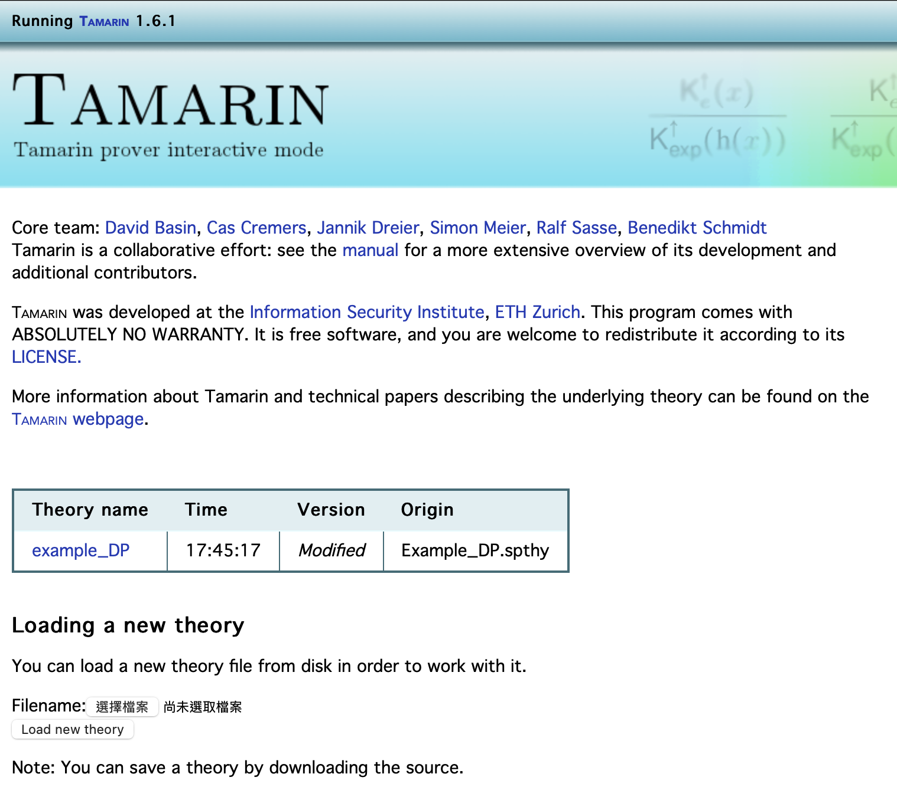
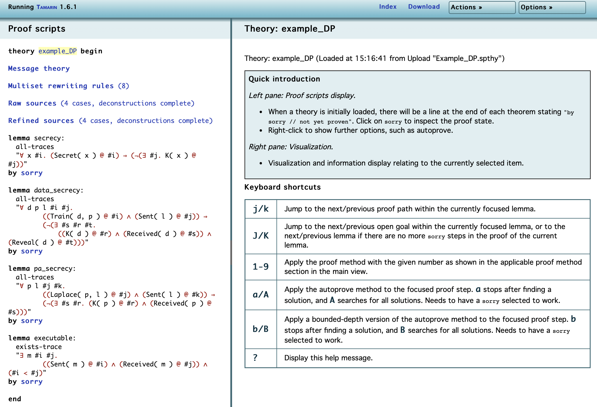
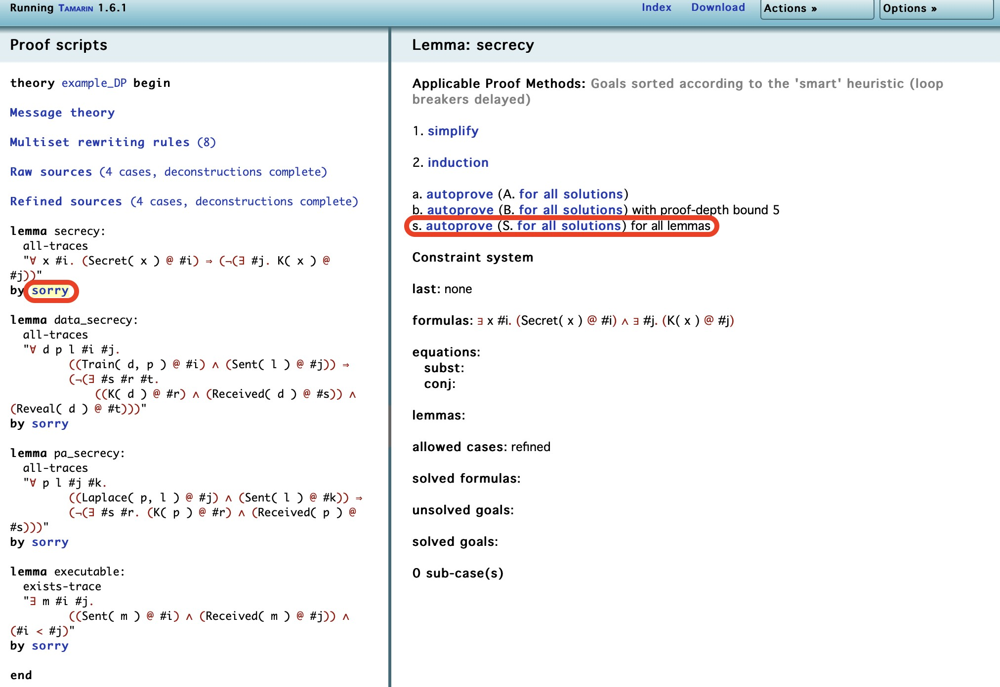
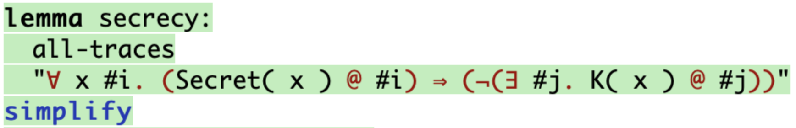
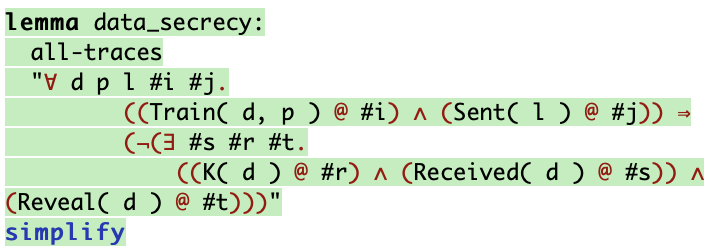
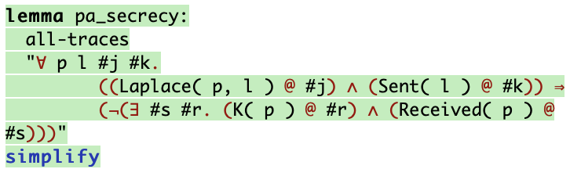
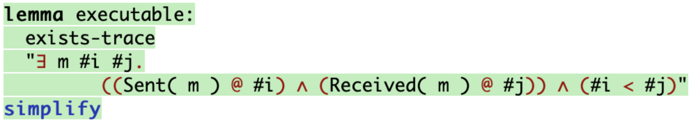
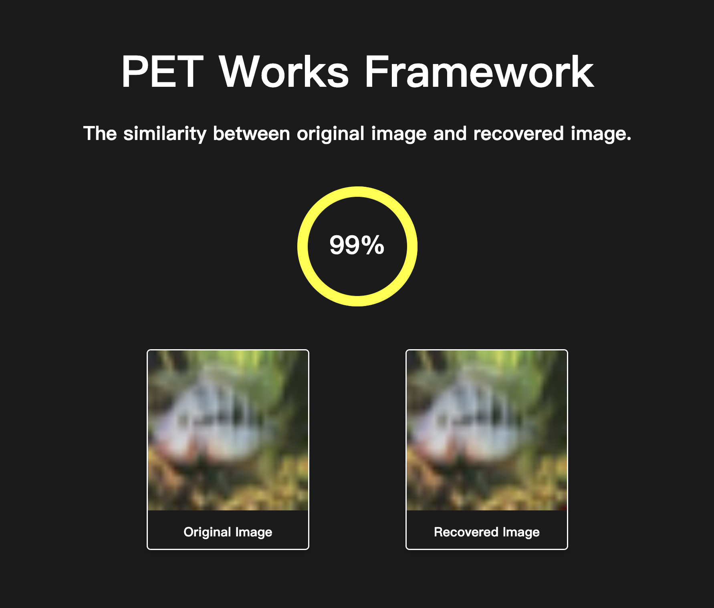
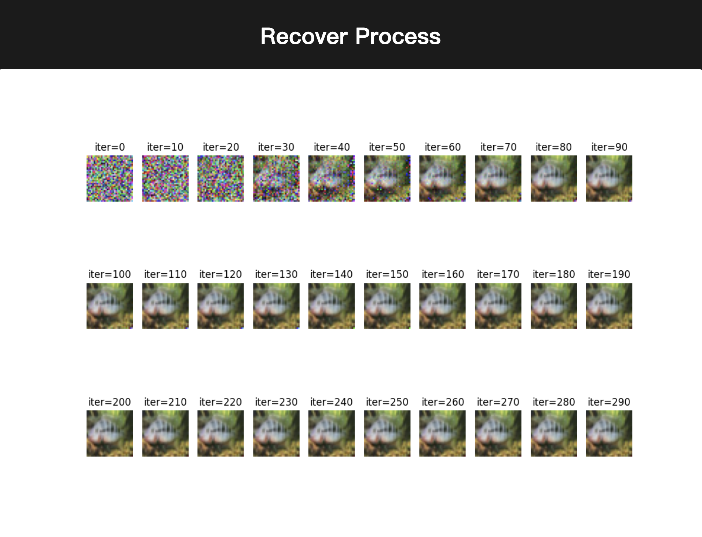

+++++++++++++++++++++++++++++++++++++++++++++++++++
Federated Learning
+++++++++++++++++++++++++++++++++++++++++++++++++++

Federated Learning Validation With Tamarin Prover
===================================================
Using Tamarin Prover [1]_ to validate the security of the Federated Learning Protocol design before beginning the implementation of Federated Learning helps in identifying potential vulnerabilities, security and privacy issues, and potential design flaws.

Please follow `the instructions <https://tamarin-prover.github.io/manual/master/book/002_installation.html>`__ in the Tamarin Prover manual to install the tool. The following is the procedure to validate the Federated Learning protocol design with Tamarin Prover.

1. Protocol Modeling: Use Tamarin Prover’s syntax to define the protocol specification for federated learning, encompassing participants, message transmission, privacy protection algorithms, and other details that depict the entire functioning of federated learning. 
2. Property Specification: Define the security characteristics to be verified, such as confidentiality, integrity, availability, etc., typically expressed in the form of lemmas. 
3. Verification Process: Employ Tamarin Prover to inspect whether the protocol complies with the defined properties, automatically detecting and recognizing security vulnerabilities and attacks within the protocol. It also provides comprehensive verification reports and recommendations. 
4. Result Analysis: Tamarin Prover generates analysis results indicating whether the protocol is secure under specific conditions, ensuring the security and reliability of the protocol. If attack scenarios are identified, users can gain insights into how attackers exploit security vulnerabilities.

Example: example_DP.spthy
--------------------------

Take the following script as an example.

::

   theory example_DP
   begin

   /*Client 1*/
   //The local data and parameters must remain confidential.
   rule client1_Send:
     [ Fr(~data1) //Generate local data
     , Fr(~pa1) //Generate a local model
     , Fr(~lm1) //Generate protected parameters
     ]
   --[ Secret(~data1)//Data confidentiality
     , Train(~data1, ~pa1)//Train the model parameters using local data
     , Secret(~pa1)//Model parameters confidentiality
     , Laplace(~pa1, ~lm1)//Add differential privacy to the model parameters
     , Sent(~lm1)//Send protected parameters
     ]->
     [ Out(~lm1) ]

   /*Client 2*/
   rule client2_Send:
     [ Fr(~data2) //Generate local data.
     , Fr(~pa2) //Generate a local model
     , Fr(~lm2) //Generate protected parameters
     ]
   --[ Secret(~data2)//Data confidentiality
     , Train(~data2, ~pa2)//Train the model parameters using local data
     , Secret(~pa2)//Model parameters confidentiality
     , Laplace(~pa2, ~lm2)//Add differential privacy to the model parameters
     , Sent(~lm2)//Send protected parameters
     ]->
     [ Out(~lm2) ]
    
   /*The server receives local parameters and performs aggregation.*/
   rule Server_Receive:
     [ In(lm1)//receive local model 1
     , In(lm2)//receive local model 2
     , Fr(~gm)//Generate global model
     ]
   --[ Received(lm1)//receive local 1
     , Received(lm2)//receive local 2
     , Cul(lm1, lm2)//aggregation
     , Sent(~gm)//Send gm
     ]->
     [ Out(~gm) ]//Send global model

   /*Client 1 receive global model.*/
   rule client1_Receive:
     [In(gm)]
   --[Received(gm)]->
     []

   /*Client 2 receive* global model.*/
   rule client2_Receive:
     [In(gm)]
   --[Received(gm)]->
     []
    
   /*Adversary reveals local data through parameters.*/
   rule adversary:
     [ In(pa) //Get parameters
     , Train(data, pa) //Inference
     ]
   --[ Reveal(data)]-> //Reveal local data 
     [ Out(data)]
    
   //confidentiality
   lemma secrecy:
     "All x #i.
       Secret(x) @i ==> not (Ex #j. K(x) @j)"  
    
   //Local model parameters confidentiality
   lemma data_secrecy:
     "All d p l #i #j. Train(d, p) @i & Sent(l) @j
     ==> 
       not (Ex #s #r #t . K(d) @r & Received(d) @s & Reveal(d) @t )"
    
   //Local data confidentiality
   lemma pa_secrecy:
     "All p l #j #k.  Laplace(p, l) @j & Sent(l) @k
     ==> 
       not (Ex #s #r . K(p) @r & Received(p) @s )"
    
   //Executable
   lemma executable:
     exists-trace
       "Ex m #i #j. Sent(m) @i & Received(m) @j & #i < #j"
    
   end

Upload the script to the Tamarin visualization tool and click on the
theory name.

|image1|

Enter the tool for verification.

|image2|

Click on the "sorry" after the first lemma in the left box (the button
marked with a red border on the left side in the image), and then select
"s. autoprove (S. for all solutions) for all lemmas" in the right box
(the button marked with a red border on the right side in the image) to
prove the entire framework in one go.

|image3|

Execution Result
----------------

When a proof is successful, the lemma appears in green; if a
counterexample that can be attacked is found, the lemma turns red.

+---------------------------------------------------+
| **Confidentiality: Approved**                     |
+===================================================+
| |image4|                                          |
+---------------------------------------------------+
| **Confidentiality of Local Data: Approved**       |
+---------------------------------------------------+
| |image5|                                          |
+---------------------------------------------------+
| **Confidentiality of Local Parameters: Approved** |
+---------------------------------------------------+
| |image6|                                          |
+---------------------------------------------------+
| **Executability: Approved**                       |
+---------------------------------------------------+
| |image7|                                          |
+---------------------------------------------------+

Reference
-------------------

.. [1] The Tamarin Team, “The Tamarin prover repository.” Aug. 07, 2023. [Online] Available: https://github.com/tamarin-prover/tamarin-prover

Validate Data With the Image Similarity
===========================================

The provided code snippet illustrates the use of PETWorks-framework for a data recovery process and its subsequent validation. The process involves three main steps: data recovery, validation, and reporting.

First, the script imports necessary functions (``dataProcess``, ``PETValidation``, ``report``) from the PETWorks library. It then defines file paths for the gradient, model, and original data with ``gradient``, ``model``, and ``originalData`` variables, respectively.

The data recovery step is performed using the ``dataProcess`` function. This function takes the model, gradient, and specifies "FL" (possibly referring to a technique or method) and "recover" as parameters to recover the data. The output of this process is stored in ``recoveredData``.

Next, the ``PETValidation`` function is used to validate the recovery process. It compares the recovered data (``recoveredData``) with the original data (``originalData``) using the "FL" method.

Example: FL.py
-------------------------

.. code-block:: python

  from PETWorks import dataProcess, PETValidation, report

  gradient = "/home/Doc/gradient"
  model = "/home/Doc/model"
  originalData = "/home/Doc/o.png"

  recoveredData = dataProcess(model, gradient, "FL", "recover")
  result = PETValidation(recoveredData, originalData, "FL")
  report(result, "web")

Web Report
-------------

Here is the showcase of the web report.

|image8|

The web report also shows the process of recovery.

|image9|

